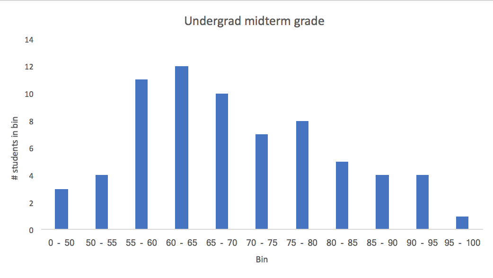
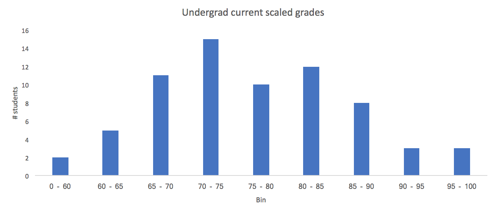

This is the distribution of exam scores, based on the 69 undergraduates in the class:

We also computed scaled grades based on the midterm and psets 1-4, weighting the pset grades by 0.125 and the midterm grade by 0.3 using the formula:

scaled_grade = ( (mean_pset/70) x 0.125 + (midterm/100) x 0.30 ) x (100 / (0.125 + 0.30))

This is the distribution of scaled grades for undergraduates:

If we were to assign letter grades right now, the minimum scaled grade required for A, B and C would roughly follow:
55 C
70 B
85+ A

The median score (69 for the midterm, 75 for the scaled grade) would be just above the cutoff for B+.

This should serve as a rough guide to how you're doing so far. We can't guarantee any particular distribution of final grades: the final median could be higher or lower than B+, and the percent score required for a given letter grade might increase or decrease depending on how the class does on the remainder of assessment.
